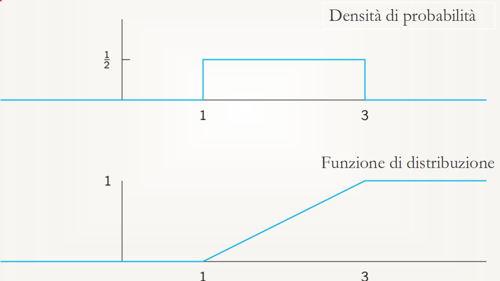
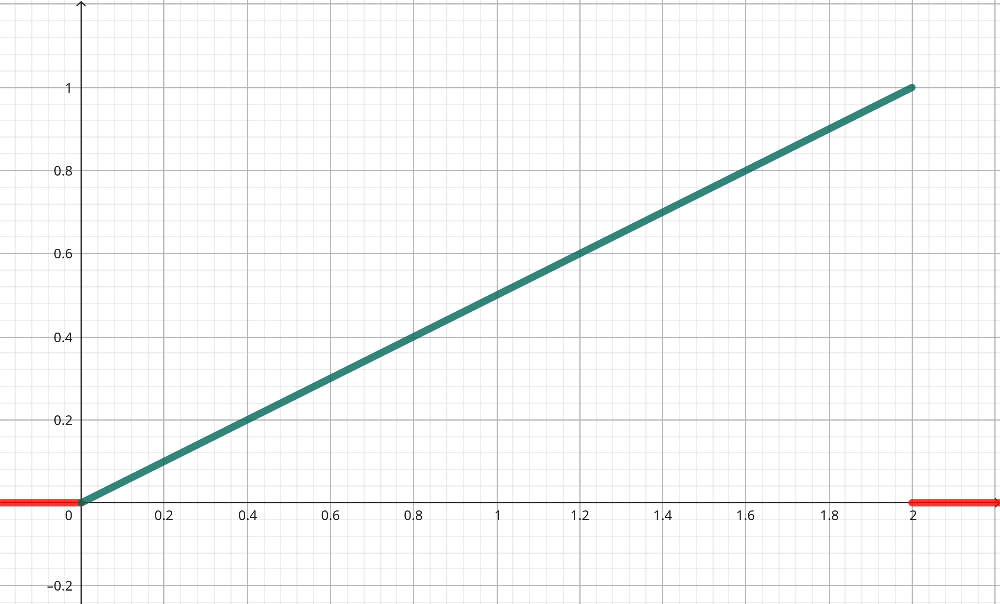
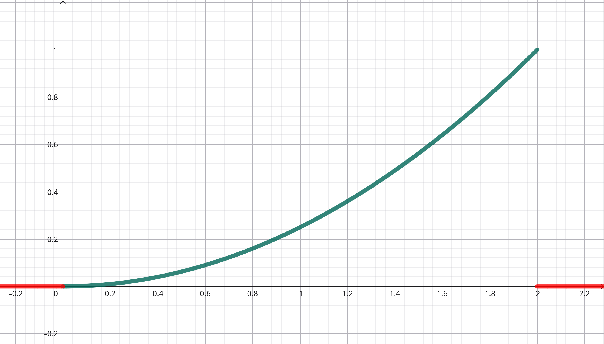

## $$ \textcolor{red}{\text{Esercizi Lez. 8 - Teoria}} $$

#### Esercizio 1

Calcolare la funzione di distribuzione di una variabile aleatoria uniforme nell’ intervallo $[\alpha, \beta]$.

##### Risoluzione

Sappiamo che la densità di probabilità di una v.a. uniforme è la seguente:

$$
f(x) = \begin{cases}
\frac1{\beta-\alpha} & \alpha\le x\le\beta \\
0 & \text{altrimenti}
\end{cases}
$$

Calcoliamo ora la funzione di distribuzione all'interno dell'intervallo $[\alpha,\beta]$:

$$\begin{aligned}
F(x) = P(X\le x) &= \int_\alpha^x f(y)\cdot dy = \int_\alpha^x \frac1{\beta-\alpha} \cdot dy \\
&= \frac1{\beta-\alpha} \int_\alpha^x dy = \boxed{\frac{x-\alpha}{\beta-\alpha}} \;.
\end{aligned}$$

La soluzione completa è quindi:

$$
F(x) = \begin{cases}
0 & x<\alpha \\[6pt]
\frac{x-\alpha}{\beta-\alpha} & \alpha\le x\le\beta \\[6pt]
1 & x>\beta
\end{cases}
$$

---

#### Esercizio 2

Sia $X$ una v.a. a.c. con densità di probabilità

$$
f(x) = \begin{cases}
\frac{x}2 & 0\le x\le2 \\
0 & \text{altrimenti}
\end{cases}
$$

calcolare la funzione di distribuzione $F(x)$.

##### Risoluzione

Calcoliamo la funzione di distribuzione di $X$ nell'intervallo $[0,2]$:

$$\begin{aligned}
F(X) = P(X\le x) &= \int_0^x f(y) \cdot dy = \int_0^x \frac{y}2 \cdot dy \\
&= \frac12\left[ \frac{y^2}2 \right]_0^x = \boxed{\frac{x^2}4} \;.
\end{aligned}$$

La soluzione completa è quindi:

$$
F(x) = \begin{cases}
0 & x<0 \\[6pt]
\frac{x^2}4 & 0\le x\le2 \\[6pt]
1 & x>2
\end{cases}
$$

---

#### Esercizio 3

Sia $X$ una v.a. con densità di probabilità:

$$
f(x) = \begin{cases}
1-|x| & -1\le x\le1 \\
0 & \text{altrimenti}
\end{cases}
$$

Calcolare la funzione di distribuzione $F(x)$.

##### Risoluzione

Calcoliamo la funzione di distribuzione nei vari intervalli.

- **Caso $x<-1$**

    Poiché la densità è nulla per $x<-1$:

    $$
    F(x)=0
    $$

- **Caso $-1\le x<0$**

    In questo intervallo $y<0$, quindi:

    $$
    |y|=-y
    \qquad\Rightarrow\qquad
    1-|y|=1+y
    $$

    Calcoliamo quindi la funzione di distribuzione:

    $$\begin{aligned}
    F(x)
    &= \int_{-1}^{x}(1+y)\,dy \\
    &= \left[y+\frac{y^2}{2}\right]_{-1}^{x} \\
    &= \left(x+\frac{x^2}{2}\right)-\left(-1+\frac12\right) \\
    &= x+\frac{x^2}{2}+\frac12
    \end{aligned}$$

- **Caso $0\le x<1$**

    In questo intervallo $y\ge0$, quindi:

    $$
    |y|=y
    \qquad\Rightarrow\qquad
    1-|y|=1-y
    $$

    La funzione di distribuzione deve accumulare anche tutta la probabilità precedente:

    $$\begin{aligned}
    F(x)
    &= \int_{-1}^{0}(1+y)\,dy
    +
    \int_{0}^{x}(1-y)\,dy
    \end{aligned}$$

    Calcoliamo il primo integrale:

    $$\begin{aligned}
    \int_{-1}^{0}(1+y)\,dy
    &= \left[y+\frac{y^2}{2}\right]_{-1}^{0} \\
    &= \frac12
    \end{aligned}$$

    Calcoliamo il secondo integrale:

    $$\begin{aligned}
    \int_{0}^{x}(1-y)\,dy
    &= \left[y-\frac{y^2}{2}\right]_{0}^{x} \\
    &= x-\frac{x^2}{2}
    \end{aligned}$$

    Sommando le due componenti:

    $$\begin{aligned}
    F(x)
    &= \frac12 + x - \frac{x^2}{2}
    \end{aligned}$$

- **Caso $x\ge1$**

    Tutta la probabilità è stata accumulata:

    $$
    F(x)=1
    $$

La funzione di distribuzione completa è quindi:

$$\boxed{
F(x)=
\begin{cases}
0 & x<-1 \\[6pt]
\frac12+x+\frac{x^2}{2} & -1\le x<0 \\[6pt]
\frac12+x-\frac{x^2}{2} & 0\le x<1 \\[6pt]
1 & x\ge1
\end{cases}
} \;.$$

---

#### Esercizio 4

Sia $X$ una v.a. a.c. con densità di probabilità

$$
f(x) = \begin{cases}
cx+3 & -3\le x\le-2 \\
3-cx & 2\le x\le3 \\
0    & \text{altrimenti}
\end{cases}
$$

- calcolare $c$,
- calcolare la funzione di distribuzione di $X$.

##### Risoluzione

1. Per calcolare il fattore $c$ dobbiamo sfruttare la probabilità totale degli intervalli:

    $$
    \int_{-3}^{-2} f(x) \cdot dx + \int_2^3 f(x) \cdot dx = 1
    $$

    Procediamo con il calcolo del primo integrale:

    $$\begin{aligned}
    \int_{-3}^{-2} f(x) \cdot dx &= \int_{-3}^{-2} (cx+3)\cdot dx = \left[ c\frac{x^2}2 + 3x \right]_{-3}^{-2} \\
    &= 2c - 6 -\frac92c+9 = -\frac52c + 3
    \end{aligned}$$

    Procediamo con il calcolo del secondo integrale:

    $$\begin{aligned}
    \int_2^3 f(x) \cdot dx &= \int_2^3 (3-cx) \cdot dx = \left[ 3x-c\frac{x^2}2 \right]_2^3 \\
    &= 9 - \frac92c - 6 + 2c = 3 - \frac52c
    \end{aligned}$$

    Adesso imponiamo la probabilità uguale ad $1$:

    $$ \left( 3-\frac52c \right) + \left( 3-\frac52c \right) = 1 $$

    $$ 6 - 5c = 1 \;\Rightarrow\; 5c = 5 \;\Rightarrow\; \boxed{c = 1} \;. $$

    Riscriviamo la densità di probabilità sostituendo $c=1$:

    $$
    f(x) = \begin{cases}
    3+x & -3\le x\le-2 \\[6pt]
    3-x & 2\le x\le3 \\[6pt]
    0    & \text{altrimenti}
    \end{cases}
    $$

2. Calcoliamo la funzione di distribuzione $F(x)$:

    - **Caso $-3\le x\le-2$**:

        $$\begin{aligned}
        F(x) = P(X\le x) &= \int_{-3}^x (3+y) \cdot dy = \left[ 3y+\frac{y^2}2 \right]_{-3}^x \\
        &= 3x + \frac{x^2}2 + 9 -\frac92 = \frac92 + 3x + \frac{x^2}2
        \end{aligned}$$

    - **Caso $-2\le x\le2$**:

        Qui la densità è nulla. Quindi il valore costante che viene propagato per questo intervallo è $F(-2)$.

        $$
        F(-2) = \frac92 +3(-2) + \frac{(-2)^2}2 = \frac12
        $$
    
    - **Caso $2\le x\le3$**:

        $$\begin{aligned}
        F(x) = P(X\le x) &= \int_{-3}^{-2} (3+y) \cdot dy + \int_2^x (3-y) \cdot dy \\
        &= \left[ 3y+\frac{y^2}2 \right]_{-3}^{-2} + \left[ 3y-\frac{y^2}2 \right]_2^x \\
        &= \left( -6+2 +9 -\frac92 \right) + \left( 3x-\frac{x^2}2 -6 +2 \right) \\
        &= -\frac{7}2 + 3x + \frac{x^2}2
        \end{aligned}$$

    La funzione di distribuzione completa è quindi:

    $$\boxed{
    F(x)=
    \begin{cases}
    0 & x<-3 \\[6pt]
    \frac92 + 3x + \frac{x^2}2 & -3\le x\le-2 \\[6pt]
    \frac12 & -2<x<2 \\[6pt]
    -\frac{7}2 + 3x + \frac{x^2}2 & 2\le x\le3 \\[6pt]
    1 & x>3
    \end{cases}
    } \;.$$

#### Esercizio 5

Sia $X$ una v.a. a.c. con funzione di distribuzione

$$
F(x) = \begin{cases}
0    & x\le 0 \\
2x^2-x^4 & 0\le x<1 \\
1 & x\ge 1
\end{cases}
$$

- calcolare $P(\frac14\le X\le\frac34)$,
- calcolare la densità di probabilità di $X$.

##### Risoluzione

1. Per prima cosa calcoliamo la densità di probabilità di $X$.

    - **Caso $x\le0$ e $x\ge1$**:

        $$
        f(x)=0
        $$

        Fuori dall'intervallo $[0,1]$ la funzione di ripartizione è costante, quindi la sua derivata è nulla.

    - **Caso $0\le x<1$**:

        $$\begin{aligned}
        f(x)
        &= F'(x) \\
        &= \frac{d}{dx}(2x^2-x^4) \\
        &= 4x-4x^3
        \end{aligned}$$

    La densità di probabilità di $X$ è quindi:

    $$\boxed{
    f(x)=\begin{cases}
    4x-4x^3 & 0\le x<1 \\[6pt]
    0 & \text{altrimenti}
    \end{cases}
    } \;.$$

2. Calcoliamo la probabilità richiesta.

    $$\begin{aligned}
    P\left(\frac14\le X\le\frac34\right)
    &= P\left(X\le\frac34\right)-P\left(X<\frac14\right) \\
    &= F\left(\frac34\right)-F\left(\frac14\right) \\
    \end{aligned}$$

    Calcoliamo i due termini:

    $$\begin{aligned}
    F\left(\frac34\right)
    &= 2\cdot\frac{9}{16}-\frac{81}{256}
    = \frac{288-81}{256}
    = \frac{207}{256}
    \end{aligned}$$

    $$\begin{aligned}
    F\left(\frac14\right)
    &= 2\cdot\frac{1}{16}-\frac{1}{256}
    = \frac{32-1}{256}
    = \frac{31}{256}
    \end{aligned}$$

    Quindi:

    $$\begin{aligned}
    P\left(\frac14\le X\le\frac34\right)
    &= \frac{207}{256}-\frac{31}{256} \\
    &= \frac{176}{256} \\
    &= \frac{11}{16}
    \approx \boxed{0.6875 = 68.75\%} \;.
    \end{aligned}$$

---

#### Esercizio 6

Il voto ad un esame è un numero in $[0,10]$. L’esame si passa con $6$. Il voto di Mario è una v.a. a.c. di densità

$$
f(x) = c \begin{cases}
\frac4{10}x & 0\le x\le5 \\
4-\frac4{10}x & 5\le x\le 10 \\
0 & \text{altrimenti}
\end{cases}
$$

- calcolare $c$.
- qual è la probabilità che Mario passi l’esame?
- Sappiamo che Mario otterrà almeno il voto x con una probabilità del 80%? Calcolare $x$.

##### Risoluzione

1. Per calcolare il fattore $c$ dobbiamo riscrivere la densità di probabilità come il prodotto tra $c$ e la funzione $g(x)$:

    $$
    f(x) = c\cdot g(x)
    $$

    A questo punto abbiamo che:

    $$
    \int_0^{10} f(x) \cdot dx = c\int_0^{10} g(x) \cdot dx \Rightarrow \boxed{c = \frac1{\int_0^{10} g(x) \cdot dx}}
    $$

    Dobbiamo risolvere il seguente integrale:

    $$
    \int_0^{19} g(x) \cdot dx = \int_0^5 g(x) \cdot dx + \int_5^{10} g(x) \cdot dx
    $$

    Calcoliamo il primo integrale:

    $$\begin{aligned}
    \int_0^5 g(x) \cdot dx
    &= \int_0^5 \frac4{10}x \cdot dx
    = \frac4{10}\left[\frac{x^2}2\right]_0^5
    = 5
    \end{aligned}$$

    Calcoliamo il secondo integrale:

    $$\begin{aligned}
    \int_5^{10} g(x) \cdot dx
    = \int_5^{10} 4 - \frac4{10}x \cdot dx
    &=\left[4x-\frac4{10}\frac{x^2}2\right]_5^{10} \\
    &=4(10-5) - \frac2{10}(100 - 25) \\
    &=20 - 15 = 5
    \end{aligned}$$

    Adesso ricaviamo $c$ sommando le due componenti:

    $$
    c = \frac1{\int_0^{10} g(x) \cdot dx} = \frac1{5+5} 
    \Rightarrow\boxed{c = \frac1{10}} \;.
    $$

    Riscriviamo quindi la densità di probabilità:

    $$
    f(x) = \begin{cases}
    \frac4{100}x & 0\le x\le5 \\
    (4-\frac4{10}x)\frac1{10} & 5\le x\le 10 \\
    0 & \text{altrimenti}
    \end{cases}$$

2. La probabilità che Mario passi l'esame è $P(X\ge6)$.

    Possiamo calcolare questa probabilità in due modi.

    - **Primo metodo (diretto)**

        $$\begin{aligned}
        P(X\ge6)
        &= \int_6^{10} \left(\frac4{10}-\frac4{100}x\right)\,dx \\
        &= \left[\frac4{10}x\right]_6^{10} -
        \left[\frac4{100}\frac{x^2}{2}\right]_6^{10} \\
        &= \frac4{10}(10-6) -
        \frac4{100}\left(\frac{10^2-6^2}{2}\right) \\
        &= \frac{16}{10} -
        \frac4{100}\left(\frac{100-36}{2}\right) \\
        &= 1.6 - \frac4{100}\cdot32 = 1.6 - 1.28 = 0.32
        \end{aligned}$$

        Quindi:

        $$
        \boxed{P(X\ge6)=0.32=32\%} \;.
        $$

    - **Secondo metodo (tramite la funzione di distribuzione)**

        Sfruttiamo la relazione:

        $$
        P(X\ge6)=1-P(X<6)=1-F(6)
        $$

        Quindi:

        $$\begin{aligned}
        F(6)
        &= \int_0^5 g(x)\,dx
        +
        \int_5^6 g(x)\,dx
        \end{aligned}$$

        Calcoliamo il primo integrale:

        $$\begin{aligned}
        \int_0^5 g(x)\,dx
        &= \int_0^5 \frac4{100}x\,dx \\
        &= \frac4{100}\left[\frac{x^2}{2}\right]_0^5 \\
        &= \frac4{100}\cdot\frac{25}{2} = 0.5
        \end{aligned}$$

        Calcoliamo il secondo integrale:

        $$\begin{aligned}
        \int_5^6 g(x)\,dx
        &= \int_5^6 \left(\frac4{10}-\frac4{100}x\right)\,dx \\
        &= \frac4{10}[x]_5^6 -
        \frac4{100}\left[\frac{x^2}{2}\right]_5^6 \\
        &= \frac4{10}(6-5) -
        \frac4{100}\cdot\frac{36-25}{2} \\
        &= 0.4 - 0.22 = 0.18
        \end{aligned}$$

        Allora:

        $$\begin{aligned}
        P(X\ge6)
        &= 1-F(6) \\
        &= 1-(0.5+0.18) \\
        &= 1-0.68 = 0.32
        \end{aligned}$$

        Quindi:

        $$
        \boxed{P(X\ge6)=32\%} \;.
        $$
    
3. Sappiamo che Mario otterrà almeno il voto $x$ con probabilità dell'$80\%$. Calcolare $x$. La condizione richiesta è:

    $$
    P(X\ge x)=0.80
    $$

    Passiamo alla probabilità complementare:

    $$\begin{aligned}
    P(X<x)
    &= 1-P(X\ge x) \\
    &= 1-0.80 \\
    &= 0.20
    \end{aligned}$$

    Quindi dobbiamo trovare il valore $x$ tale che:

    $$
    F(x)=0.20
    $$

    Osserviamo che:

    $$
    F(5)=0.50
    $$

    quindi il valore cercato appartiene al primo intervallo $0\le x\le5$, dove:

    $$
    f(y)=\frac4{100}y
    $$

    Calcoliamo la funzione di ripartizione:

    $$\begin{aligned}
    F(x)
    &= \int_{0}^{x}\frac4{100}y\,dy \\
    &= \frac4{100}\left[\frac{y^2}{2}\right]_0^x
    = \frac{x^2}{50}
    \end{aligned}$$

    Impostiamo quindi:

    $$\begin{aligned}
    \frac{x^2}{50}
    &= 0.20 \\
    x^2
    &= 10 \\
    x
    &= \pm\sqrt{10}
    \end{aligned}$$

    Poiché $x$ rappresenta un voto appartenente all'intervallo $[0,10]$, scegliamo la soluzione positiva:

    $$
    \boxed{x=\sqrt{10}\approx3.16} \;.
    $$

---

> ### Funzione di ripartizione e intervalli separati
>
> **Nota.** Può capitare che la densità di probabilità di una variabile aleatoria sia definita su intervalli separati tra loro. In tali casi, negli intervalli in cui la densità vale $0$, la funzione di ripartizione rimane costante.
>
> Questo accade perché, se $f(x)=0$ in un certo intervallo, non viene accumulata nuova probabilità.
>
> Ad esempio, se:
>
> $$
> f(x)=\begin{cases}
> f_1(x) & -3\le x\le-2 \\
> 0 & -2<x<2 \\
> f_2(x) & 2\le x\le3
> \end{cases}
> $$
>
> allora la funzione di ripartizione:
>
> $$
> F(x)=\int_{-\infty}^{x} f(y)\,dy
> $$
>
> cresce nel primo intervallo $[-3,-2]$, rimane costante nell'intervallo $(-2,2)$ e ricomincia a crescere nell'intervallo $[2,3]$.
>
> In particolare:
>
> $$
> F(x)=F(-2)
> \qquad\text{per } -2<x<2
> $$
>
> perché in quell'intervallo la densità è nulla e quindi non si accumula ulteriore probabilità.

> **Nota.** Se una variabile aleatoria è assolutamente continua e si conosce la funzione di ripartizione $F(x)$, allora la densità di probabilità si ottiene derivando $F(x)$:
>
> $$f(x)=F'(x)$$
>
> Se $F(x)$ è definita a tratti, la derivata va calcolata separatamente in ciascun intervallo.

---

> ### Trovare il fattore $\mathbf c$ di normalizzazione
>
> **Nota.** Per trovare il fattore di normalizzazione $c$ di una densità di probabilità si impone sempre che la probabilità totale sia uguale a $1$:
>
> $$
> \int_{-\infty}^{+\infty} f(x)\,dx = 1
> $$
>
> Esistono però due casi comuni.
>
> ---
>
> #### Caso 1 — $f(x)=c\cdot g(x)$
>
> Se la costante $c$ può essere raccolta direttamente dalla densità, allora:
>
> $$
> \int_{-\infty}^{+\infty} c\,g(x)\,dx = 1
> $$
>
> e quindi:
>
> $$
> c\int_{-\infty}^{+\infty} g(x)\,dx = 1
> $$
>
> Da cui:
>
> $$
> c =
> \frac{1}{
> \int_{-\infty}^{+\infty} g(x)\,dx
> }
> $$
>
> ---
>
> #### Caso 2 — densità definita a tratti
>
> Se la densità è definita su più intervalli e $c$ non è immediatamente estraibile in un'unica forma, allora bisogna sommare i contributi di tutti gli intervalli:
>
> $$
> \int_{a_1}^{b_1} f_1(x)\,dx +
> \int_{a_2}^{b_2} f_2(x)\,dx + \dots = 1
> $$
>
> Si calcolano quindi separatamente gli integrali e si sostituiscono i risultati nell'equazione precedente. In questo modo si ottiene un'equazione contenente $c$, che può essere risolta normalmente.
>
> Ad esempio:
>
> $$
> \frac{25}{2}c + \frac{25}{2}c = 1
> \quad\Rightarrow\quad 25c = 1
> \quad\Rightarrow\quad c=\frac1{25} 
> $$
> 

---

> ### Calcolo della funzione di ripartizione
>
> **Nota.** Quando si calcola la funzione di ripartizione di una variabile aleatoria assolutamente continua, bisogna sempre accumulare tutta la probabilità fino al punto $x$:
>
> $$
> F(x)=\int_{-\infty}^{x} f(y)\,dy
> $$
>
> Se la densità è definita a tratti, allora nel calcolo di $F(x)$ occorre sommare anche i contributi degli intervalli precedenti. Ad esempio, se:
>
> $$
> f(x)=\begin{cases}
> f_1(x) & a\le x\le b \\
> f_2(x) & b\le x\le c
> \end{cases}
> $$
>
> allora, per $b\le x\le c$,
>
> $$
> F(x) = \int_a^b f_1(y)\,dy + \int_b^x f_2(y)\,dy
> $$
>
> perché la funzione di ripartizione rappresenta sempre la probabilità totale accumulata fino a $x$.

---